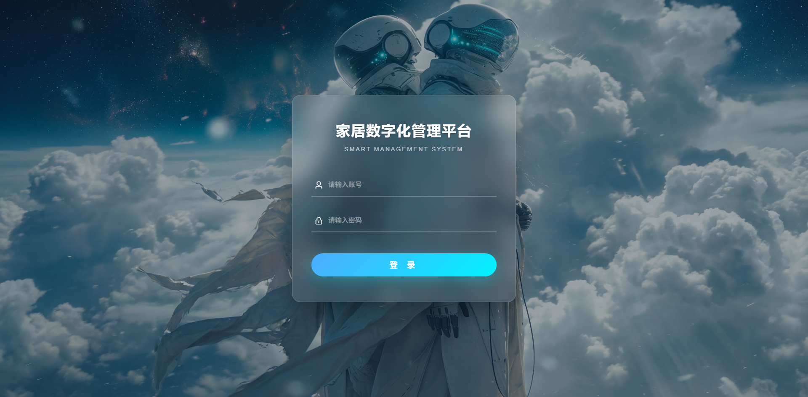
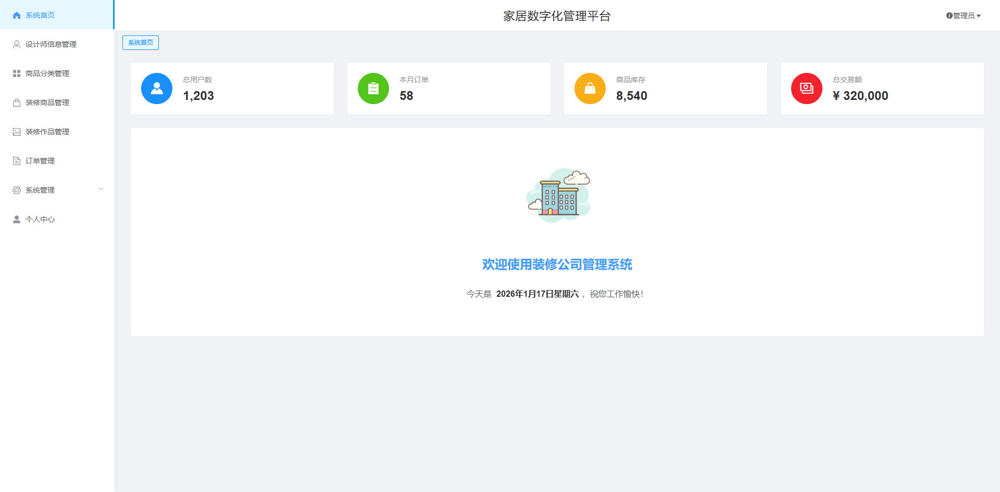
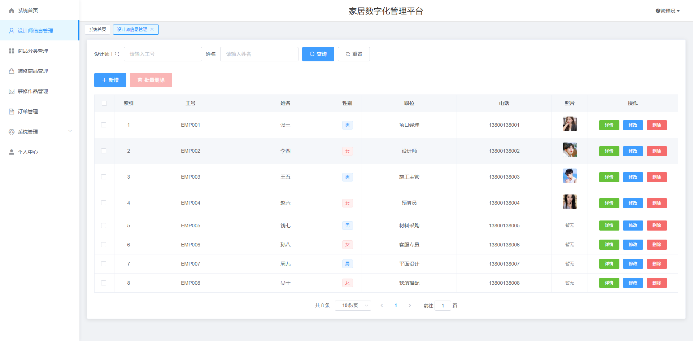
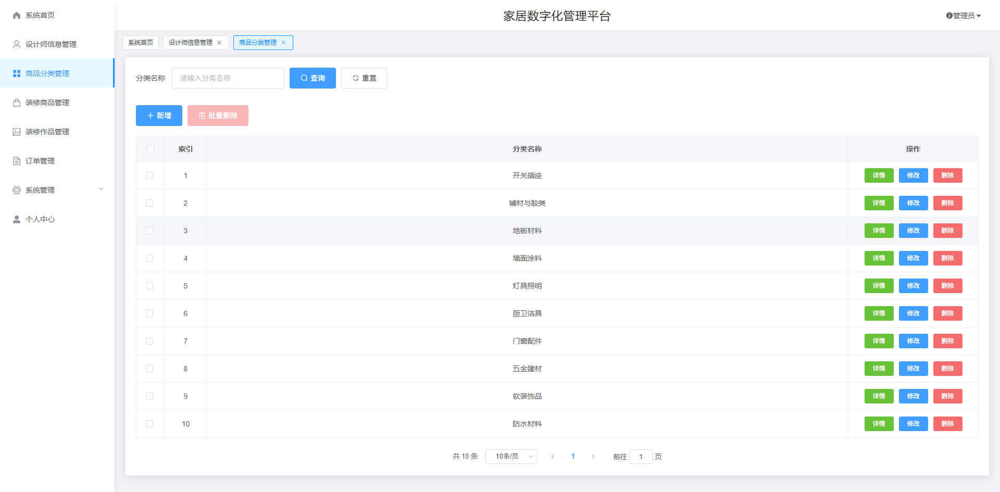
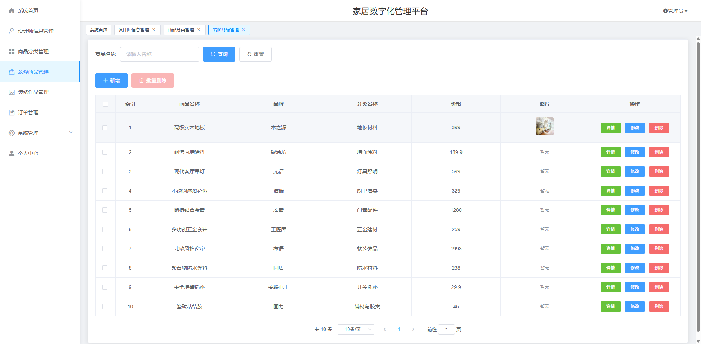
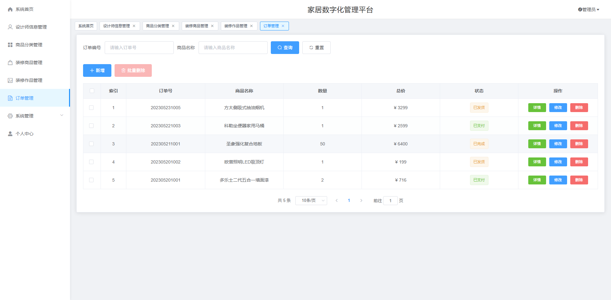
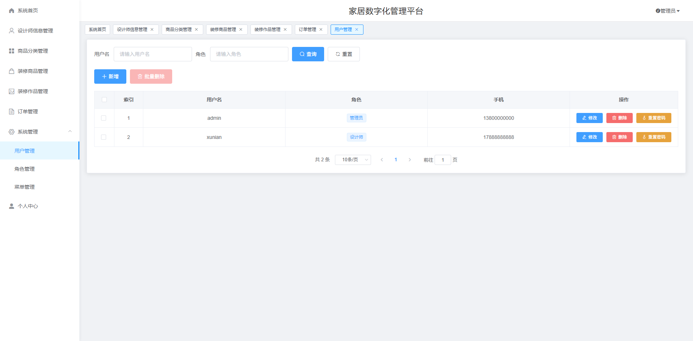
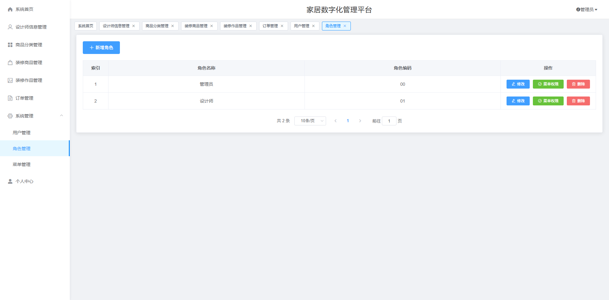
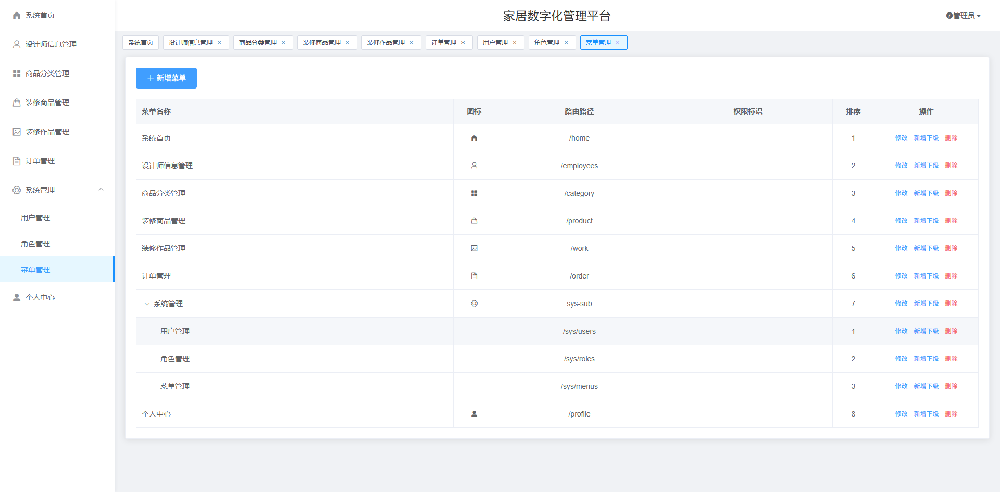
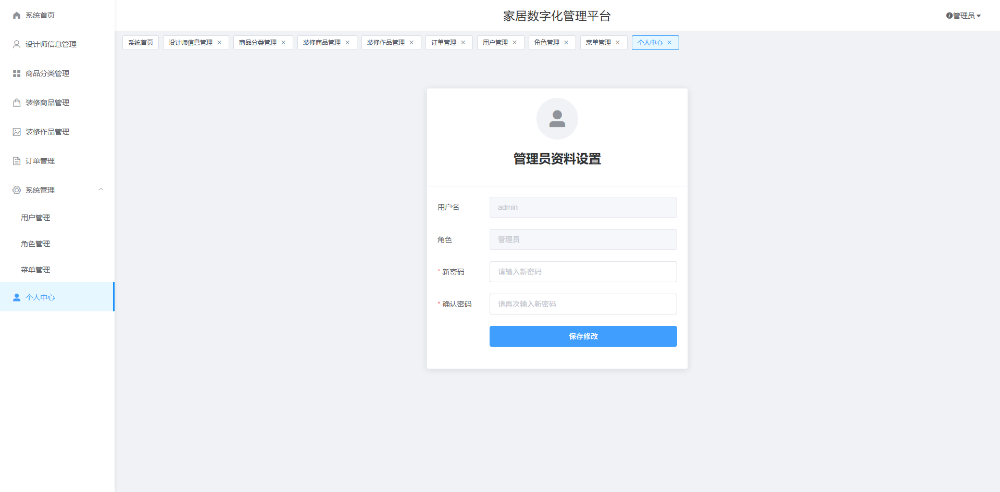

# 基于Springboot的家居数字化平台

# Springboot-design-system

### 技术栈

mybatisplus vue2 element-ui

## 数据库

mysql (19张表)

## 运行截图

### 前台
先不放、等项目完成后再更新
目测会添加AI功能

### 后台













## 需要看运行视频或源码
不会部署可＋V kelly_oi

## 访问网址

### 前台
还没做好，等项目完成后再更新
```
http://localhost:8080/springboot2z04j/front/index.html

账号 用户名2
密码 123456
```

### 后台
还没做好，等项目完成后再更新，征求专业朋友的意见改善项目中
```
 http://localhost:8081/login.html

账号 admin
密码 123456
```


